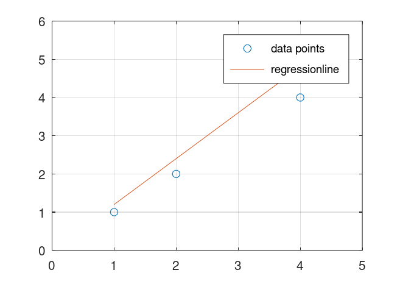

---
## Front matter
lang: ru-RU
title: Защита лабораторной работы 3
subtitle: по предмету научное программирование
author:
  - Дидусь К. В.
institute:
  - Российский университет дружбы народов, Москва, Россия
date: 27 сентября 2022

## i18n babel
babel-lang: russian
babel-otherlangs: english

## Formatting pdf
toc: false
toc-title: Содержание
slide_level: 2
aspectratio: 169
section-titles: true
theme: metropolis
header-includes:
 - \metroset{progressbar=frametitle,sectionpage=progressbar,numbering=fraction}
 - '\makeatletter'
 - '\beamer@ignorenonframefalse'
 - '\makeatother'
---

# Информация

## Докладчик

:::::::::::::: {.columns align=center}
::: {.column width="70%"}

  * Дидусь Кирилл Валерьевич
  * Студент 5 курса ФФМиЕН
  * Российский университет дружбы народов

:::
::: {.column width="30%"}

:::
::::::::::::::

# Вводная часть

## Актуальность

- Научная деятельность зачастую сопроваждается большим обьемом вычислений.
- Необходимо обладать знаниями компьютерной алгебры и обращения с системами для математических вычислений.
- Октава является свободным и бесплатным ПО, совместимым с MATLAB и схожим по функционалу.

## Объект и предмет исследования

- Язык Octave

## Цели и задачи

- Ознакомится с  система для математических вычислений Octave.
- Повторить примеры из лабораторной в Octave.

## Материалы и методы

- примеры из лабораторной работы
- язык Octave
- gui встроенный в Octave

# Выполнение лабораторной работы

## Действия с векторами и матрицами

Изучили синтаксис работы с векторами и матрицами. Научились задавать векторы, вертикальные векторы, матрицы и выполнять действия над ними. Применяли команды:

- cross
- dot
- inv
- norm
- det
- rank
- eig

## Построение графиков

Построили несколько графиков применяя команды:

- plot
- hold
- grid
- axis
- legend

## Построение графиков
{#fig:001 width="70%"}

## Повторяющиеся вычисления

Время на 100000 операций сложения:

- При использовании цикла: 0.482202
- При использовании векторных операций: 0.00348496

## Вывод

Ознакомились с языком Октава и синтаксисом для базовых вычислений. 