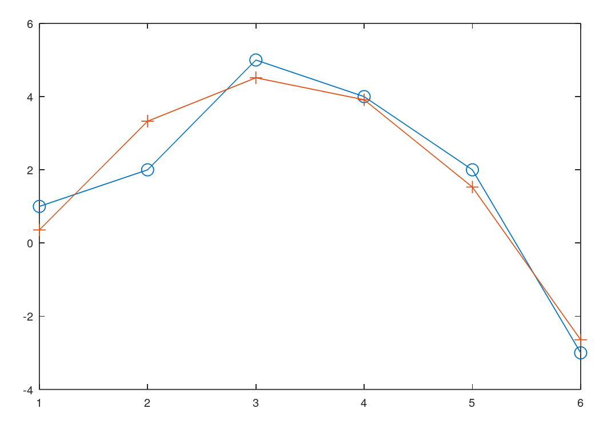
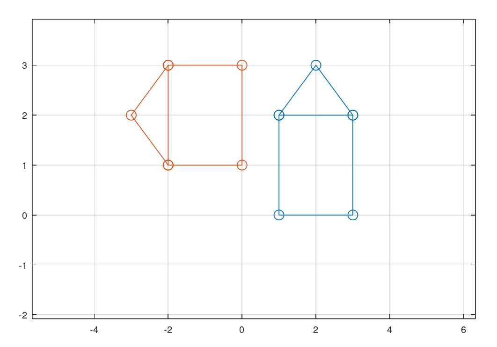
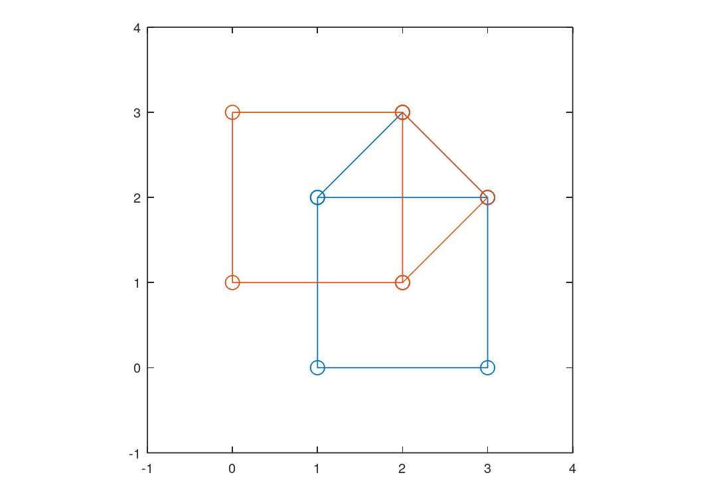
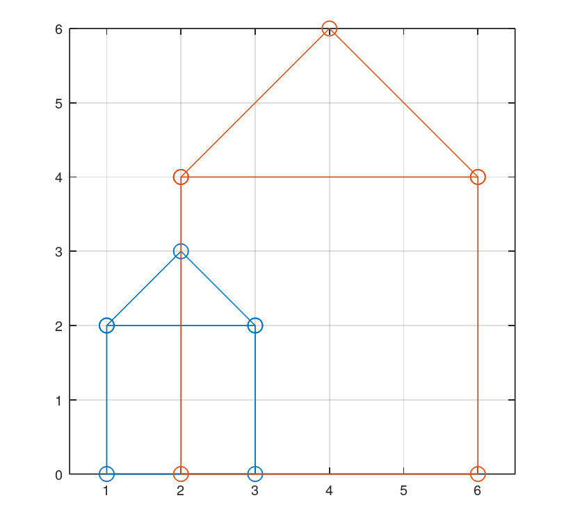

---
## Front matter
lang: ru-RU
title: Защита лабораторной работы 5
subtitle: по предмету научное программирование
author:
  - Дидусь К. В.
institute:
  - Российский университет дружбы народов, Москва, Россия
date: 8 ноября 2022

## i18n babel
babel-lang: russian
babel-otherlangs: english

## Formatting pdf
toc: false
toc-title: Содержание
slide_level: 2
aspectratio: 169
section-titles: true
theme: metropolis
header-includes:
 - \metroset{progressbar=frametitle,sectionpage=progressbar,numbering=fraction}
 - '\makeatletter'
 - '\beamer@ignorenonframefalse'
 - '\makeatother'
---

# Информация

## Докладчик

:::::::::::::: {.columns align=center}
::: {.column width="70%"}

  * Дидусь Кирилл Валерьевич
  * Студент 5 курса ФФМиЕН
  * Российский университет дружбы народов

:::
::: {.column width="30%"}

:::
::::::::::::::

# Вводная часть

## Актуальность

- Научная деятельность зачастую сопроваждается большим обьемом вычислений.
- Необходимо обладать знаниями компьютерной алгебры и обращения с системами для математических вычислений.
- Октава является свободным и бесплатным ПО, совместимым с MATLAB и схожим по функционалу.

## Объект и предмет исследования

- Язык Octave

## Цели и задачи

- Ознакомится с методом подгонки полиномиальной кривой, а также выполнения матричных преобразований с помощью Octave. 
- Повторить примеры из лабораторной в Octave.

## Материалы и методы

- примеры из лабораторной работы
- язык Octave
- gui встроенный в Octave

# Выполнение лабораторной работы

# Выполнение лабораторной работы

## Подгонка полиномиальной кривой

Для подгонки полиномиальной кривой используем функции polyfit(x,y,order) и polyval(P,xdata). Найдем значение кривой в точках xdata по формуле y = polyval(polyfit(xdata,ydata,order), xdata), где order - порядок кривой.

{ #fig:001 width=70% }

## Поворот фигуры

Для того чтобы повернуть фигуру необходимо умножить матрицу вращения R с заданным углом поворота theta на матрицу D задающую изображение. 

{ #fig:002 width=70% }

## Отражение фигуры

Для того чтобы отразить фигуру необходимо умножить матрицу отражения R на матрицу D задающую изображение. 

{ #fig:003 width=70% }

## Дилатация фигуры

Для того чтобы растянуть фигуру необходимо умножить матрицу деформации T с коэффициентом k на матрицу D задающую изображение. 

{ #fig:004 width=70% }

## Вывод

Ознакомились с методом подгонки полиномиальной кривой, а также выполнения матричных преобразований с помощью Octave.  