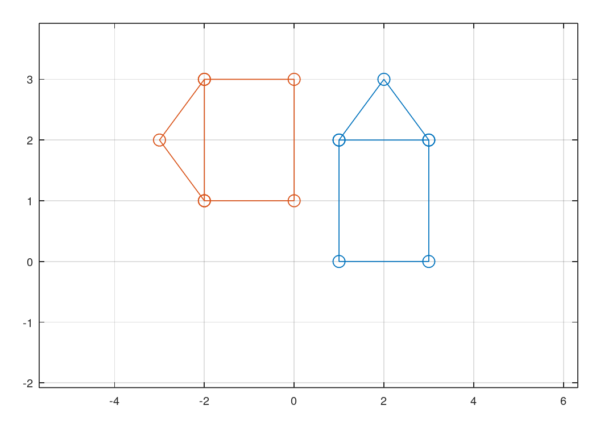

---
## Front matter
title: "Отчёта по лабораторной работе 5"
subtitle: "по предмету 'Научное программирование'"
author: "Дидусь Кирилл Валерьевич"

## Generic otions
lang: ru-RU
toc-title: "Содержание"

## Bibliography
bibliography: bib/cite.bib
csl: pandoc/csl/gost-r-7-0-5-2008-numeric.csl

## Pdf output format
toc: true # Table of contents
toc-depth: 2
lof: true # List of figures
lot: false # List of tables
fontsize: 12pt
linestretch: 1.5
papersize: a4
documentclass: scrreprt
## I18n polyglossia
polyglossia-lang:
  name: russian
  options:
	- spelling=modern
	- babelshorthands=true
polyglossia-otherlangs:
  name: english
## I18n babel
babel-lang: russian
babel-otherlangs: english
## Fonts
mainfont: PT Serif
romanfont: PT Serif
sansfont: PT Sans
monofont: PT Mono
mainfontoptions: Ligatures=TeX
romanfontoptions: Ligatures=TeX
sansfontoptions: Ligatures=TeX,Scale=MatchLowercase
monofontoptions: Scale=MatchLowercase,Scale=0.9
## Biblatex
biblatex: true
biblio-style: "gost-numeric"
biblatexoptions:
  - parentracker=true
  - backend=biber
  - hyperref=auto
  - language=auto
  - autolang=other*
  - citestyle=gost-numeric
## Pandoc-crossref LaTeX customization
figureTitle: "Рис."
tableTitle: "Таблица"
listingTitle: "Листинг"
lofTitle: "Список иллюстраций"
lotTitle: "Список таблиц"
lolTitle: "Листинги"
## Misc options
indent: true
header-includes:
  - \usepackage{indentfirst}
  - \usepackage{float} # keep figures where there are in the text
  - \floatplacement{figure}{H} # keep figures where there are in the text
---

# Цель работы

Ознакомится с  система для математических вычислений Octave.

# Задание

Повторить примеры из лабораторной в Octave.

# Теоретическое введение

GNU Octave — свободная программная система для математических вычислений, использующая совместимый с MATLAB язык высокого уровня.

Octave представляет интерактивный командный интерфейс для решения линейных и нелинейных математических задач, а также проведения других численных экспериментов. Кроме того, Octave можно использовать для пакетной обработки. Язык Octave оперирует арифметикой вещественных и комплексных скаляров, векторов и матриц, имеет расширения для решения линейных алгебраических задач, нахождения корней систем нелинейных алгебраических уравнений, работы с полиномами, решения различных дифференциальных уравнений, интегрирования систем дифференциальных и дифференциально-алгебраических уравнений первого порядка, интегрирования функций на конечных и бесконечных интервалах. Этот список можно легко расширить, используя язык Octave (или используя динамически загружаемые модули, созданные на языках C, C++, Фортран и др.).

В этой лабораторной рассматривается подгонка полиномиальной кривой, а также матричные преобразования, такие как:

1. Поворот
2. Отражение
3. Дилатация

# Выполнение лабораторной работы

1. Для подгонки полиномиальной кривой используем функции polyfit(x,y,order) и polyval(P,xdata). Найдем значение кривой в точках xdata по формуле y = polyval(polyfit(xdata,ydata,order), xdata), где order - порядок кривой.

2. Для того чтобы повернуть фигуру необходимо умножить матрицу вращения R с заданным углом поворота theta на матрицу D задающую изображение. 

{ #fig:001 width=70% }

3. Для того чтобы отразить фигуру необходимо умножить матрицу отражения R на матрицу D задающую изображение. 

{ #fig:002 width=70% }

4. Для того чтобы растянуть фигуру необходимо умножить матрицу деформации T с коэффициентом k на матрицу D задающую изображение. 

{ #fig:003 width=70% }

# Выводы

Ознакомились с методом подгонки полиномиальной кривой, а также выполнения матричных преобразований с помощью Octave. 

# Список литературы{.unnumbered}

::: {#refs}
- ТУИС
:::
