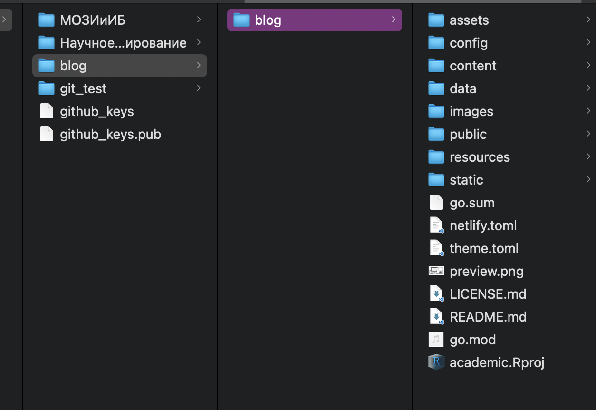
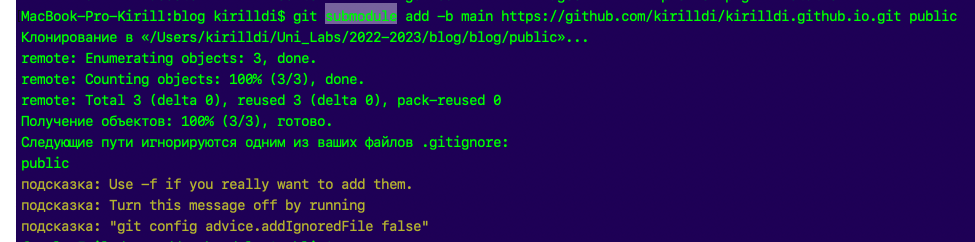
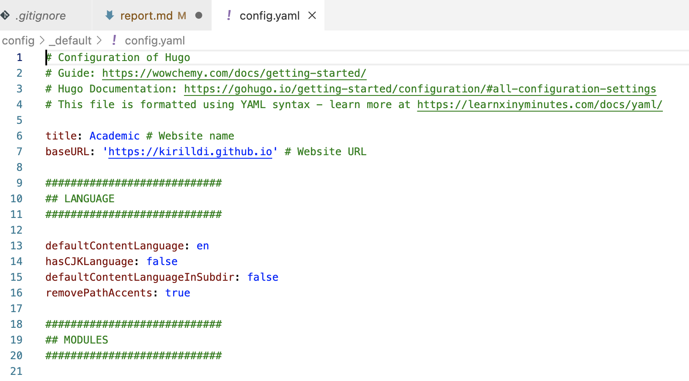
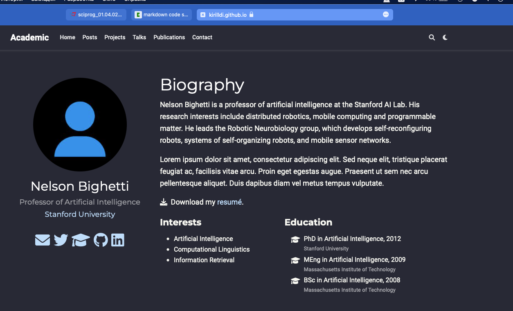

---
## Front matter
lang: ru-RU
title: Защита этапа номер 1 индивидуального проекта
subtitle: по предмету "Научное программирование"
author:
  - Дидусь К.В.
institute:
  - Российский университет дружбы народов, Москва, Россия
date: 24 сентября 2022

## i18n babel
babel-lang: russian
babel-otherlangs: english

## Formatting pdf
toc: false
toc-title: Содержание
slide_level: 2
aspectratio: 169
section-titles: true
theme: metropolis
header-includes:
 - \metroset{progressbar=frametitle,sectionpage=progressbar,numbering=fraction}
 - '\makeatletter'
 - '\beamer@ignorenonframefalse'
 - '\makeatother'
---

# Информация

## Докладчик

:::::::::::::: {.columns align=center}
::: {.column width="70%"}

  * Дидусь Кирилл Валерьевич
  * Студент 5 курса ФФМиЕН
  * Российский университет дружбы народов

:::
::: {.column width="30%"}

:::
::::::::::::::

# Вводная часть

## Актуальность

- Личный блог является важным инструментов в научной коммуникации. Он позволяет получить доступ к научным работам, связаться с автором и получить общее впечатление о нем. 
- GitHub популярный инструмент, с которым нужно уметь работать

## Объект и предмет исследования

- Программное обеспечение для создания личного блога

## Цели и задачи

- Создать собственный блог для научной коммуниации
- Установить необходимое программное обеспечение.
- Скачать шаблон темы сайта.
- Разместить его на хостинге git.
- Разместить заготовку сайта на Github pages.

## Материалы и методы

- Процессор `hugo` для для быстрого создания сайтов
- Хостинг GitHub Pages
- Шаблон сайта с wowchemy

# Создание сайта

## Создадим 2 репозитория: 
- blog (клон из репозитория с академической темой wowchemy)
- kirillidi.github.io (репозитория для статичных файлов сайта, будущая страница сайта) (рис. [-@fig:001])

{ #fig:001 width=70% }

## Клонируем репозиторий blog в каталог /blog и запустим локальный сервер hugo командой **hugo server** (рис. [-@fig:002]). 

{ #fig:002 width=70% }

# Размещение сайта

## Добавим подмодуль public в репозиторий blog. Перед этим обязательно добавим commit в репозиторий kirillidi.github.io, для избежания ошибок (рис. [-@fig:003]). 

{ #fig:003 width=70% }

## Изменим baseURL в файле config.yaml на kirilldi.github.io (рис. [-@fig:004]).

{ #fig:004 width=70% }

## Выполним коммит изменений в соотвествующие репозитории и запустим сайт командой hugo. Затем проверим работоспособность сайта. Все работает! (рис. [-@fig:005]).

{ #fig:005 width=70% }

# Заключение

В результате работы мы имеем шаблон сайта на github pages. В дальнейшем мы будем его редактировать.