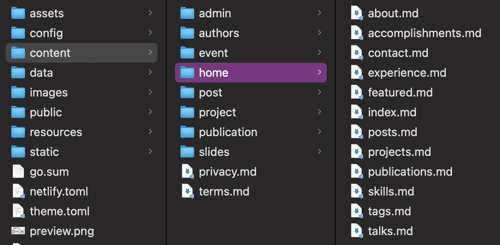
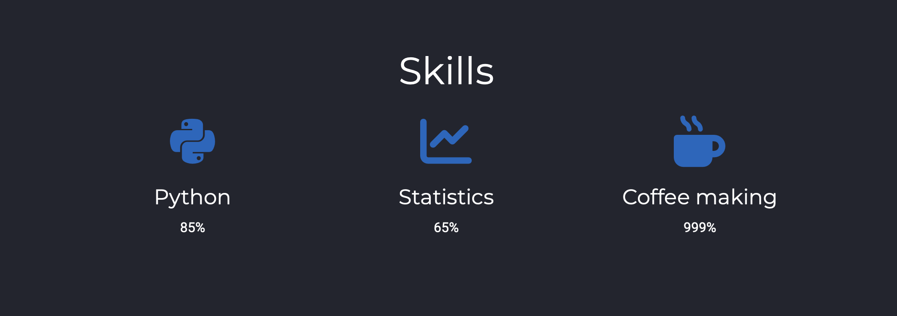
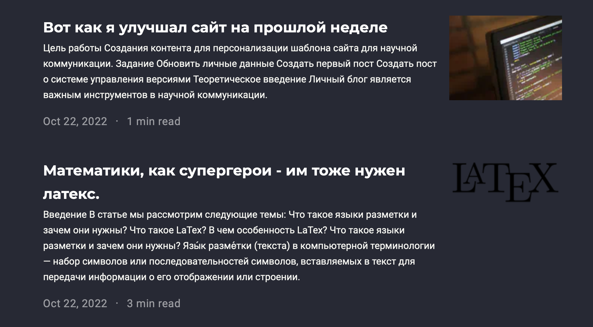

---
## Front matter
lang: ru-RU
title: Защита этапа номер 3 индивидуального проекта
subtitle: по предмету "Научное программирование"
author:
  - Дидусь К.В.
institute:
  - Российский университет дружбы народов, Москва, Россия
date: 22 октября 2022

## i18n babel
babel-lang: russian
babel-otherlangs: english

## Formatting pdf
toc: false
toc-title: Содержание
slide_level: 2
aspectratio: 169
section-titles: true
theme: metropolis
header-includes:
 - \metroset{progressbar=frametitle,sectionpage=progressbar,numbering=fraction}
 - '\makeatletter'
 - '\beamer@ignorenonframefalse'
 - '\makeatother'
---

# Информация

## Докладчик

:::::::::::::: {.columns align=center}
::: {.column width="70%"}

  * Дидусь Кирилл Валерьевич
  * Студент 5 курса ФФМиЕН
  * Российский университет дружбы народов

:::
::: {.column width="30%"}

:::
::::::::::::::

# Вводная часть

## Актуальность

- Личный блог является важным инструментов в научной коммуникации. Он позволяет получить доступ к научным работам, связаться с автором и получить общее впечатление о нем. 
- GitHub популярный инструмент, с которым нужно уметь работать

## Объект и предмет исследования

- Программное обеспечение для создания личного блога

## Цель работы

Создание контента для персонализации шаблона сайта для научной коммуникации.

## Задание

- Добавить к сайту достижения.
- Создать пост по прошлой неделе.
- Создать пост о легковесных языках разметки

## Материалы и методы

- Процессор `hugo` для для быстрого создания сайтов
- Хостинг GitHub Pages
- Шаблон сайта с wowchemy

# Выполнение лабораторной работы

1. Найдем папку /content/home/ и внесем необходимые изменения в файлы соответствующие нужному блоку шаблона. Нас интересует раздел skills, activities and experience. (рис. [-@fig:001]). 

{ #fig:001 width=70% }

## Выполнение лабораторной работы

3. Выполним коммит изменений в соотвествующие репозитории и запустим сайт командой hugo. Затем проверим работоспособность сайта. Все работает! (рис. [-@fig:002]).

{ #fig:002 width=70% }

## Выполнение лабораторной работы

3. Создадим новый пост командой hugo new --kind post post/your-post-name. Он добавится в папку content/post. 

## Выполнение лабораторной работы

4. Выполним коммит изменений в соотвествующие репозитории и запустим сайт командой hugo. Затем проверим работоспособность сайта. Все работает! (рис. [-@fig:003]).

{ #fig:003 width=70% }

# Выводы

В результате работы мы имеем персонализированный шаблон сайта на github pages. В дальнейшем мы будем продолжать его редактировать.