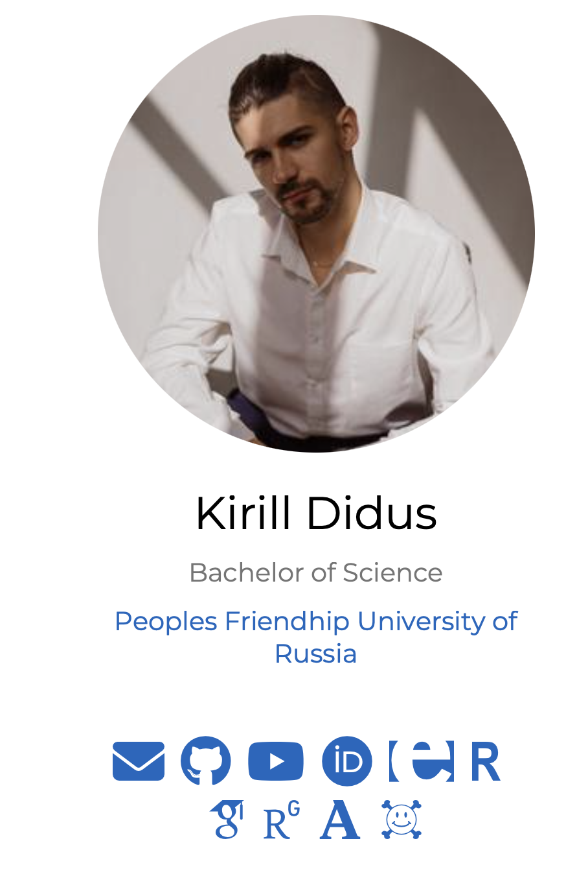
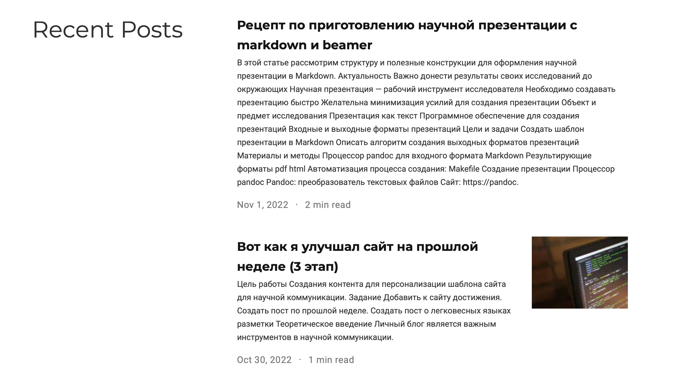

---
## Front matter
title: "Отчёта по 4-му этапу индвидуального проекта"
subtitle: "по предмету 'Научное программирование'"
author: "Кирилл Валерьевич Дидусь"

## Generic otions
lang: ru-RU
toc-title: "Содержание"

## Bibliography
bibliography: bib/cite.bib
csl: pandoc/csl/gost-r-7-0-5-2008-numeric.csl

## Pdf output format
toc: true # Table of contents
toc-depth: 2
lof: true # List of figures
lot: true # List of tables
fontsize: 12pt
linestretch: 1.5
papersize: a4
documentclass: scrreprt
## I18n polyglossia
polyglossia-lang:
  name: russian
  options:
	- spelling=modern
	- babelshorthands=true
polyglossia-otherlangs:
  name: english
## I18n babel
babel-lang: russian
babel-otherlangs: english
## Fonts
mainfont: PT Serif
romanfont: PT Serif
sansfont: PT Sans
monofont: PT Mono
mainfontoptions: Ligatures=TeX
romanfontoptions: Ligatures=TeX
sansfontoptions: Ligatures=TeX,Scale=MatchLowercase
monofontoptions: Scale=MatchLowercase,Scale=0.9
## Biblatex
biblatex: true
biblio-style: "gost-numeric"
biblatexoptions:
  - parentracker=true
  - backend=biber
  - hyperref=auto
  - language=auto
  - autolang=other*
  - citestyle=gost-numeric
## Pandoc-crossref LaTeX customization
figureTitle: "Рис."
tableTitle: "Таблица"
listingTitle: "Листинг"
lofTitle: "Список иллюстраций"
lotTitle: "Список таблиц"
lolTitle: "Листинги"
## Misc options
indent: true
header-includes:
  - \usepackage{indentfirst}
  - \usepackage{float} # keep figures where there are in the text
  - \floatplacement{figure}{H} # keep figures where there are in the text
---

# Цель работы

Создания контента для персонализации шаблона сайта для научной коммуникации.

# Задание

- Добавить к сайту достижения.
- Создать пост по прошлой неделе.
- Создать пост о легковесных языках разметки

# Теоретическое введение

Личный блог является важным инструментов в научной коммуникации. Он позволяет получить доступ к научным работам, связаться с автором и получить общее впечатление о нем. 

Для создания блога воспользуемся следующими инструментами:
- github
- github pages в качестве хостинга
- hugo (программа с шаблонами для быстрого создания сайтов)
- Wowchemy (подборка  тем для hugo)

# Выполнение лабораторной работы

1. Найдем папку /content/authors/admin и внесем необходимые изменения в файлы соответствующие нужному блоку шаблона (рис. [-@fig:001]). Подберем иконки и вставим ссылки. Получим кнопки для перехода по ссылкам.

2. Выполним коммит изменений в соотвествующие репозитории и запустим сайт командой hugo. Затем проверим работоспособность сайта. Все работает! (рис. [-@fig:001]).

{ #fig:001 width=70% }

3. Создадим новый пост командой hugo new -kind post post/your-post-name. Он добавится в папку content/post. 

4. Выполним коммит изменений в соотвествующие репозитории и запустим сайт командой hugo. Затем проверим работоспособность сайта. Все работает! (рис. [-@fig:002]).

{ #fig:002 width=70% }

# Выводы

В результате работы мы имеем персонализированный шаблон сайта на github pages. В дальнейшем мы будем его редактировать.

# Список литературы{.unnumbered}

- ТУИС РУДН
- HUGO
- WOWCHEMY
::: {#refs}
:::
